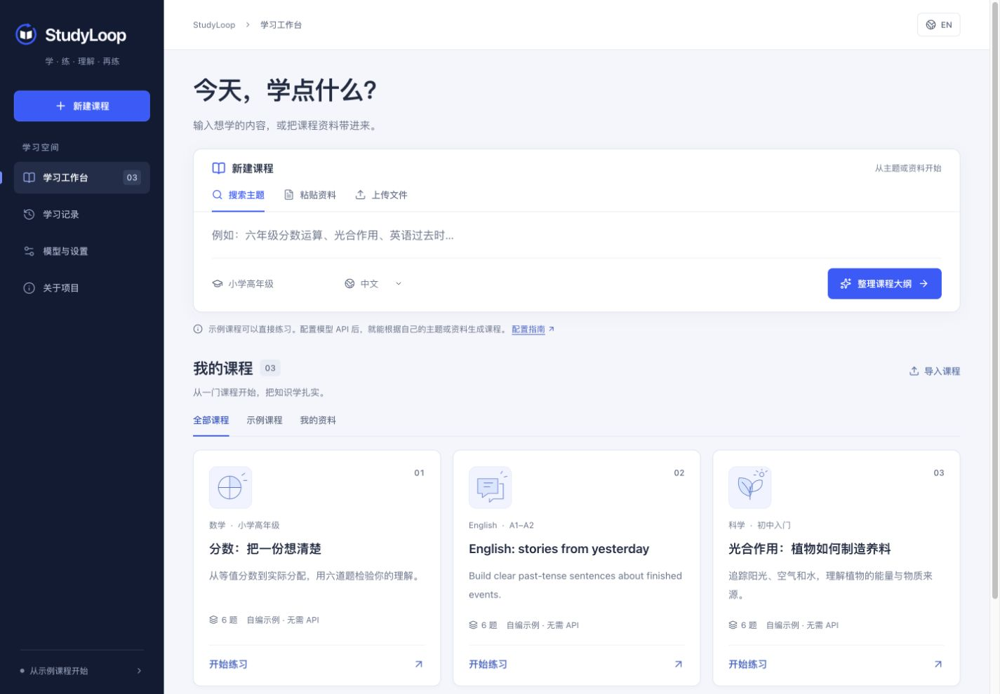

# StudyLoop

[](https://github.com/win223909/studyloop/actions/workflows/ci.yml)

**把想学的内容变成课程，把做过的练习变成理解。**

[English](README.md) · [模型配置](docs/configuration.md) · [45 项服务商目录](docs/model-providers.md) · [使用说明](docs/user-guide.md) · [故障排查](docs/troubleshooting.md) · [OpenMAIC 接入](docs/openmaic.md) · [路线图](docs/roadmap.md)

StudyLoop 是一个可自行部署的学生学习平台。输入课程名称、学科关键词，或提供自己的课程资料，确认学习范围后生成有来源的练习；通过答卷回放、逐题讲解和巩固题继续学习。课程结构适用于不同学科，第一阶段重点打磨中小学生的使用体验。

**当前版本：`v0.1.0-alpha.1`，可以运行的早期版本。** 三门原创示例课无需模型 API；任意课程生成需要部署者配置自己的模型服务。公开仓库不包含作者的 API Key、学生答卷或私人学校资料。

> **特别感谢 OpenMAIC。** 感谢 [OpenMAIC](https://github.com/THU-MAIC/OpenMAIC)、THU-MAIC 团队及所有贡献者，为开源 AI 互动教育提供的重要基础。StudyLoop 已内置 OpenMAIC 真实课堂运行时，复用模型配置，并从练习结果直接进入针对性课堂。固定上游源码、StudyLoop 改动及原许可证一同保留。[接入方式与致谢说明](docs/openmaic.md)。



## 现在可以做什么

- **直接体验**：分数、光合作用、英语一般过去时三门原创示例课，不需要账户或 API Key。
- **创建课程**：输入关键词搜索、粘贴文字，或上传可提取文字的 PDF、TXT、Markdown；先确认知识点，再生成 4、6 或 8 道选择题。
- **查看依据**：保留课程来源和每题引用。关键词默认搜索 Wikipedia；覆盖不足时，模型最多提出三个细分检索词，自动补查一轮并再次核对，仍不足就明确失败。可选 Brave Search 扩展网页摘要来源，并保留摘要标记。
- **练习与回放**：选择答案或“我不会”，查看固定保存的原始成绩和答卷；讲解后再做一道巩固题，原成绩保持不变。
- **管理学习记录**：预览后删除答卷、巩固练习与本地关联文件；没有其他记录引用时一并清理生成课程与题库，并支持重试关联课堂清理。
- **使用国内教材**：从官方智慧教育平台目录选择教材，登录阅读后按章节上传或粘贴资料，保留版本、章节／页码与来源链接。当前不自动抓取登录后的正文。[操作说明](docs/user-guide.md#mainland-china-textbooks--国内教材)
- **衔接教学**：使用分步讲解和浏览器朗读，再从答卷直接生成内置 OpenMAIC 互动课堂。
- **分享课程包**：导入、导出经过格式校验的课程 JSON。
- **选择模型服务**：可搜索 [45 个服务与区域预设](docs/model-providers.md)，按国内、国际、本地分组，也可自定义接口；支持三类协议，模型 ID 自行填写，密钥只保存在服务端。
- **自行部署**：同一个项目与 Docker 镜像管理 StudyLoop 和内部课堂进程，无需独立部署 OpenMAIC。

本版支持选择题、中英文界面和文字提取。OCR、直接导入任意网页、班级名单、跨设备学生账户，以及 OpenMAIC 课堂进度自动回传列在[后续计划](docs/roadmap.md)中。

## 快速开始

准备 **Node.js 22 系列的 22.13 或更高版本**、npm 和 Corepack。课堂使用固定 pnpm 10.28.0；如果 Node 发行版未附带 Corepack，请先安装 Corepack。

```bash
git clone https://github.com/win223909/studyloop.git
cd studyloop
npm ci
cp .env.example .env
npm run build
npm start
```

首次构建会安装依赖并编译内置课堂，可能需要数分钟及数 GB 工作磁盘空间；之后按源码与改动层哈希复用构建缓存。构建无需模型密钥。

打开 **[http://localhost:3210](http://localhost:3210)**，先选择示例课程体验完整流程。默认模型配置留空，此时不会调用付费模型，也不能生成新课程。

需要生成新课程时，在运行 StudyLoop 的电脑上通过本机地址直接进入 **“模型与设置”**，搜索服务商或按分组浏览，选择 API 账户对应的地域，填写自己的 API 地址、模型 ID 和密钥。可以先测试连接再保存；连接测试会发送少量真实模型请求，可能产生费用。保存会写入私有配置文件，默认是 `.env`，也可在启动时由 `SETTINGS_FILE` 指定，对新生成请求立即生效，无需重启。已有密钥不会读回网页：留空保留、明确清除时删除，更换服务或 API 地址必须重新填写密钥。

远程普通学生只看到只读说明，共享实例口令不会授予远程管理权限。仍可手动编辑 `.env`，手动修改后需要重启。各家模型配置、SSH 管理和容器持久化见[模型配置指南](docs/configuration.md)。不要把私有配置上传到 GitHub，也不要把密钥写进前端代码。

### Docker 启动

```bash
cp .env.example .env
docker compose up -d --build
```

同样打开 localhost 地址。提供的 Compose 文件将端口绑定在本机回环地址，并用独立卷保存学习数据。**默认桥接网络 Docker 部署未开放图形化管理，请手动配置。** `env_file` 只提供启动环境变量，不等于可写的持久配置文件；自定义 `SETTINGS_FILE` 需要挂载私有可写目录，也不会绕过本机连接检查。详见[配置持久化](docs/configuration.md#docker-persistence--docker-配置持久化)和[部署说明](docs/self-hosting.md)。

## 一次学习怎么进行

1. 选择示例课，或输入“六年级等值分数”等主题；创建新课时选择搜索、上传或粘贴资料。
2. 检查来源、学习水平和课程大纲，勾选要练习的知识点和题数。
3. 每题选择答案，确实不会时选择“我不会”，然后提交。
4. 查看答卷回放，阅读薄弱知识点的分步讲解，并完成独立的巩固题。
5. 如需互动课堂，在答卷结果点击“生成互动课堂”，确认大纲后进入内置 OpenMAIC 学习，随后返回原答卷继续巩固。

详细中英文操作步骤见[使用指南](docs/user-guide.md)。

Wikipedia 属于百科资料，教材章节可能覆盖不足或使用不同术语。仍提示资料不足时，可选择建议的细分主题，或粘贴／上传相关章节。自动补查仅用于关键词搜索，不会把粘贴或上传的材料发送给搜索引擎；补查会多等待一轮检索与模型核对，也可能增加模型费用。

## 题目质量与数据

生成的题库会经过结构检查及另一轮答案、来源复核。这可以减少错误，但不能保证所有题目绝对正确；发现题目或解析有疑问时，应结合来源核实。课程导出包含答案，适合学习与分享，不用于保密考试。

生成过程支持有限恢复：无损去掉明确包装、重试格式错误，或将首次格式错误、截断、结构不合格的出题重新分成小批；限定范围内的官方 MiniMax-M3 复核首次超时或截断时，可保留已出题库，仅在原有两次上限内重试复核。不会猜补残缺 JSON，也不会保存只校验了一部分的题库，恢复批失败或复核拒绝仍会停止。错误页面在可用时提供阶段与请求编号；支持的写入 API 可用 `Idempotency-Key` 在响应丢失后取回原保存结果。详见[恢复机制、幂等重试与验收范围](docs/troubleshooting.md)。

部署者可在本机管理表单提交密钥，密钥保存在服务端，已有值不会回传到网页。生成的课程和答卷由匿名浏览器会话隔离；可设置实例访问密码保护共享部署。此版没有跨设备账户和找回功能，清除浏览器 Cookie 后将无法访问原会话的记录。经典课堂另存于浏览器 IndexedDB，请导出备份。共享实例前请阅读[安全与隐私说明](SECURITY.md)。

## 开发与贡献

```bash
npm run classroom:install
npm run dev
npm test
npm run check
npx playwright install chromium
npm run test:classroom
npm run test:e2e
```

开发页面使用 5173 端口，API 使用 3210 端口。服务商目录附有官方文档，未声称逐服务商、逐模型完成线上实测。自动化测试使用可控制的模拟响应，不需要付费 API；测试证明的是协议处理逻辑，不代表已逐一验证所有服务商线上模型的教学质量。[架构](docs/architecture.md) · [课程包格式](docs/course-packs.md) · [贡献指南](CONTRIBUTING.md) · [更新记录](CHANGELOG.md)。

## 许可证与致谢

StudyLoop 原创代码使用 [MIT 许可证](LICENSE)，内置原创示例资料按各课程包的来源声明使用 CC0-1.0。导入资料、检索内容及独立安装的第三方项目遵循各自条款。

再次感谢 **[OpenMAIC](https://github.com/THU-MAIC/OpenMAIC)**。内置课堂固定上游提交 `dfebbcf33f3a56064129903faeab70a9e4243146`，StudyLoop 改动以独立适配层保存。上游应用使用 MIT，其中 `mathml2omml` 使用 LGPL-3.0-or-later；发布包包含源码和替换重建说明。完整说明见[第三方声明](THIRD_PARTY_NOTICES.md)。
