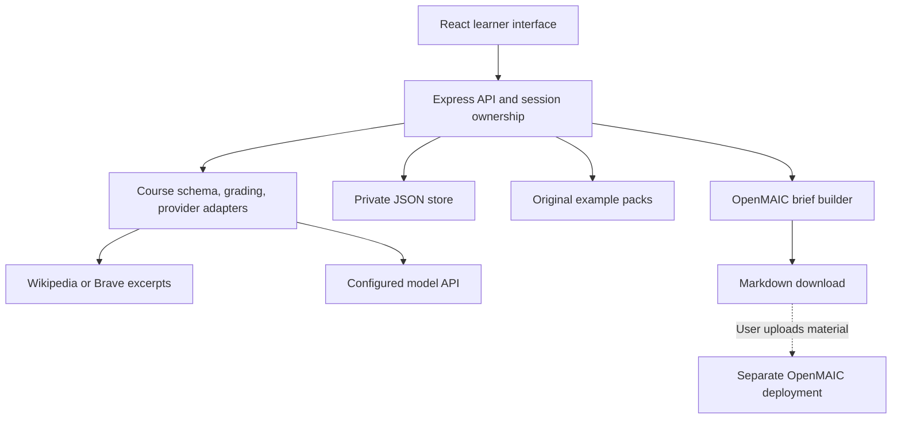

# Architecture

StudyLoop is a small, self-hostable application: a React/Vite frontend, an Express API, and a file-backed store. Course data is independent of a school, textbook, or model vendor. The application runs as one process per data directory.

## Code map

| Path                              | Responsibility                                                                    |
| --------------------------------- | --------------------------------------------------------------------------------- |
| `src/`                            | Learner flow, bilingual interface, quiz and review screens                        |
| `server/app.js`                   | HTTP routes, session ownership, access gate, request limits                       |
| `server/store.js`                 | Local JSON persistence, atomic file replacement, serialized local counter updates |
| `server/uploads.js`               | Bounded text/PDF extraction without OCR                                           |
| `server/core/schema.js`           | Validated portable course contract, public projection, grading                    |
| `server/core/providers.js`        | Search, model protocols, planning, generation, review                             |
| `server/core/samples.js`          | Loading original sample packs                                                     |
| `server/integrations/openmaic.js` | Identity-free targeted Markdown lesson brief, no network calls                    |
| `examples/`                       | Original reusable educational course packs                                        |
| `tests/`                          | Unit, protocol, integration, and browser acceptance coverage                      |

## Course creation and review

1. A course plan is created from a topic plus retrieved or supplied evidence. User-supplied and retrieved text are data, never instructions.
2. The server saves the plan to its browser owner. The learner selects a nonempty subset of its objectives and a supported question count.
3. The model authors a course bank with main questions, explanations, short lessons, separate transfer questions, and source IDs.
4. A blind answer review solves the main and transfer questions independently; a further review checks explanation/lesson support against the evidence. Disputed output is rejected, not silently published.
5. Schema validation checks IDs, bounds, answer indexes, unique choices, references, and distinct transfer questions before saving the course.

A normal new course uses one outline call and three bank-related calls (authoring, blind answer review, and explanation/evidence review). The review model can differ from the authoring model while sharing the configured provider. Model reviews remain fallible. A fixed arithmetic solver, a human moderation queue, curriculum certification, and automated repair retries are not currently implemented.

## Attempt immutability

An attempt stores its question text, choices, selected answers, correct indexes, explanations, and lesson snapshot. The persistence record also holds the source course. Replay, practice grading, and OpenMAIC export refer to that snapshot, so later course imports do not rewrite a submitted result. Follow-up practice is saved separately and cannot change the original score.

The ordinary public course projection excludes answers and lesson/practice keys until submission. Explicit course export returns the full bank for educational reuse; exam secrecy is outside the product contract.

## Private persistence and ownership

Anonymous browser sessions receive a random cookie. The server keeps a hashed token as record owner and verifies ownership on access. The instance password is an optional entrance gate, not an identity provider. Generated courses, plans, attempts, and practice are private to their browser owner; original samples are shared.

JSON file writes use private permissions and atomic replacement. A single-process queue coordinates shared daily usage updates. This design has no multi-process locking, replication, query index, role system, automatic retention, or recovery UI. Scaling to schools requires a database and an explicit identity/authorization design.

## Integration boundary

OpenMAIC is a separate system in this release. StudyLoop creates a portable teaching brief and optionally shows an operator-configured deployment link. It neither reuses API credentials nor submits materials automatically. See [the OpenMAIC contract](openmaic.md) for compatibility evidence and roadmap boundaries.

## Operational boundary

Model adapters use server configuration only; the frontend cannot select arbitrary remote endpoints or supply raw provider headers. Search uses known provider endpoints, and this alpha does not fetch arbitrary submitted URLs. Generation has bounded concurrency and a persisted UTC daily request counter, but provider cost must still be controlled at the provider account. [Security](../SECURITY.md) and [self-hosting](self-hosting.md) describe the remaining limits.
