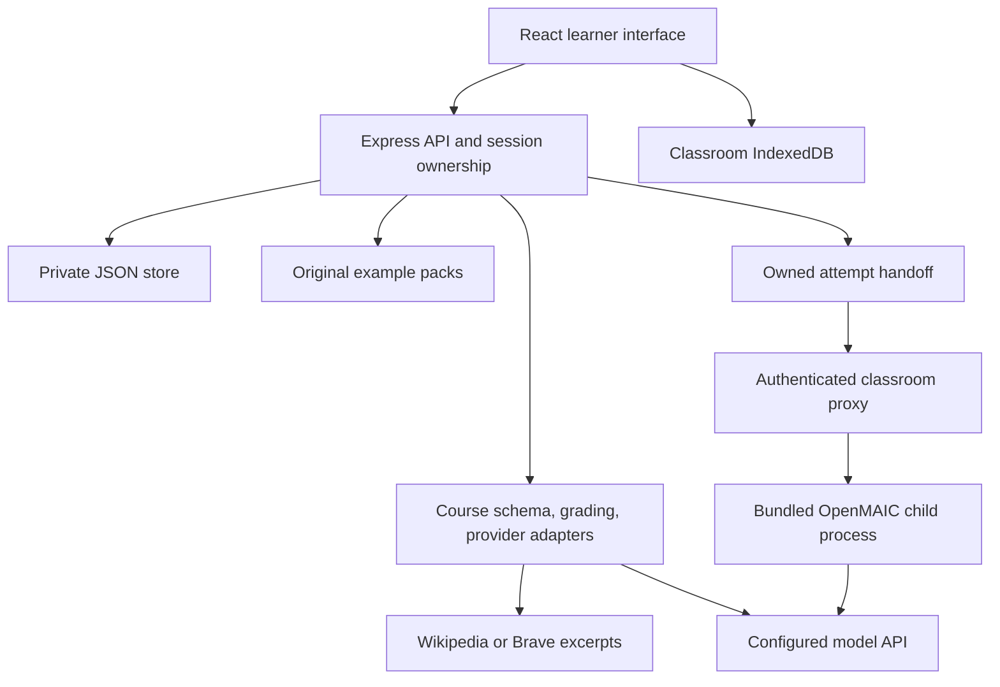

# Architecture

StudyLoop is a small, self-hostable application: a React/Vite frontend, an Express API, and a file-backed store. Course data is independent of a school, textbook, or model vendor. One StudyLoop API process owns each data directory and manages an internal OpenMAIC Next.js child process.

## Code map

| Path                                      | Responsibility                                                                    |
| ----------------------------------------- | --------------------------------------------------------------------------------- |
| `src/`                                    | Learner flow, bilingual interface, quiz and review screens                        |
| `server/app.js`                           | HTTP routes, session ownership, access gate, request limits                       |
| `server/store.js`                         | Local JSON persistence, atomic file replacement, serialized local counter updates |
| `server/uploads.js`                       | Bounded text/PDF extraction without OCR                                           |
| `server/core/schema.js`                   | Validated portable course contract, public projection, grading                    |
| `server/core/providers.js`                | Search, model protocols, planning, generation, review                             |
| `server/core/samples.js`                  | Loading original sample packs                                                     |
| `server/integrations/openmaic.js`         | Targeted learning context and optional Markdown brief from the saved attempt      |
| `server/integrations/openmaic-runtime.js` | Starts and stops the internal Next.js runtime                                     |
| `server/integrations/openmaic-proxy.js`   | Session-gated proxy and shared model routing                                      |
| `integrations/openmaic/overlay/`          | Source changes for classic classrooms, handoff, and managed settings              |
| `vendor/openmaic/`                        | Pinned clean source archive, integrity manifest, and license notices              |
| `scripts/build-openmaic.mjs`              | Verified source extraction, overlay, dependency install, and standalone build     |
| `examples/`                               | Original reusable educational course packs                                        |
| `tests/`                                  | Unit, protocol, integration, and browser acceptance coverage                      |

## Course creation and review

1. A course plan is created from a topic plus retrieved or supplied evidence. User-supplied and retrieved text are data, never instructions.
2. The server saves the plan to its browser owner. The learner selects a nonempty subset of its objectives and a supported question count.
3. The model authors a course bank with main questions, explanations, short lessons, separate transfer questions, and source IDs.
4. A blind answer review solves the main and transfer questions independently; a further review checks explanation/lesson support against the evidence. Disputed output is rejected, not silently published.
5. Schema validation checks IDs, bounds, answer indexes, unique choices, references, and distinct transfer questions before saving the course.

A normal new course uses one outline call and three bank-related calls (authoring, blind answer review, and explanation/evidence review). The review model can differ from the authoring model while sharing the configured provider. Model reviews remain fallible. A fixed arithmetic solver, a human moderation queue, curriculum certification, and automated repair retries are not currently implemented.

## Attempt immutability

An attempt stores its question text, choices, selected answers, correct indexes, explanations, and lesson snapshot. The persistence record also holds the source course. Replay, practice grading, and OpenMAIC handoff refer to that snapshot, so later course imports do not rewrite a submitted result. Follow-up practice is saved separately and cannot change the original score.

The ordinary public course projection excludes answers and lesson/practice keys until submission. Explicit course export returns the full bank for educational reuse; exam secrecy is outside the product contract.

## Private persistence and ownership

Anonymous browser sessions receive a random cookie. The server keeps a hashed token as record owner and verifies ownership on access. The instance password is an optional entrance gate, not an identity provider. Generated courses, plans, attempts, and practice are private to their browser owner; original samples are shared.

JSON file writes use private permissions and atomic replacement. A single-process queue coordinates shared daily usage updates and related record mutations. This design has no multi-process locking, replication, query index, role system, automatic retention, or account recovery UI. Scaling to schools requires a database and an explicit identity/authorization design.

Attempt deletion computes an owned dependency scope under that queue; a revision hash prevents confirming a stale preview. Non-sample course banks and generation plans are removed only without remaining references. New courses store a trusted internal `planId`; legacy plans require an unambiguous match of metadata and complete source snapshots. The file batch pre-reads backups and attempts restoration on normal I/O failures; it is not crash-atomic. A completed minimal ownership receipt enables idempotent retries and authorises the browser cleanup bridge after the attempt has gone. HTTP 404 alone never authorises deletion of classroom data. See [deletion scope and exclusions](user-guide.md#delete-a-learning-record--删除学习记录).

## Integration boundary

OpenMAIC is bundled from a pinned clean source archive plus a visible StudyLoop overlay. The API lazily starts its standalone Next.js child and proxies an allowlist of classroom routes through StudyLoop session checks. An owned attempt creates the handoff; the learner confirms the outline before generating up to six classic scenes. The classroom uses server-selected provider/model settings, and client-supplied keys or endpoint overrides are not accepted.

Classrooms live in browser IndexedDB, with export for backups. Server classroom persistence, arbitrary uploads, Pro/PBL, cloud media, and MP4 export are disabled. Returning to the original attempt preserves its score; there is no automatic completion receipt or score sync. See [the OpenMAIC guide](openmaic.md) for source provenance, rebuild instructions, and supported features.

## Operational boundary

Generation uses server configuration only; a learner cannot override the model endpoint or raw provider headers. The authenticated local management form can update the operator's configuration under the restrictions documented in [configuration](configuration.md). Search uses known provider endpoints, and this alpha does not fetch arbitrary submitted URLs. Generation has bounded concurrency and a persisted UTC daily request counter, but provider cost must still be controlled at the provider account. [Security](../SECURITY.md) and [self-hosting](self-hosting.md) describe the remaining limits.
